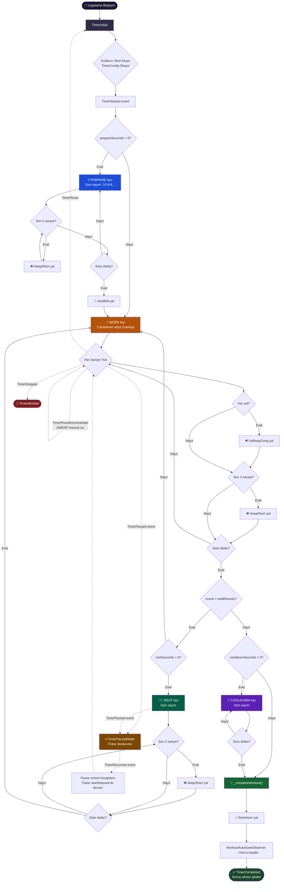

# 🏋️ Fonksiyonel Fitness Timer — Sistem Mimarisi Raporu

> **Tarih:** 30 Haziran 2026  
> **Flutter SDK:** ^3.11.5 · **Dart:** ^3.11.5  
> **Paketler:** flutter_bloc · go_router · get_it · hive_ce · supabase_flutter · audioplayers

---

## 1. Dizin ve Mimari Yapısı

### Genel Mimari Felsefe

Proje **Clean Architecture** ile **Feature-First** (Özellik-Öncelikli) organizasyonu **hibrit** biçimde birleştiriyor. Her feature kendi `data / domain / presentation` katmanlarını içeriyor; `core/` ise tüm feature'lar tarafından paylaşılan altyapıyı barındırıyor.

```
lib/
├── main.dart                    ← Uygulama giriş noktası (bootstrap + runApp)
├── bootstrap.dart               ← Supabase, Hive, DI, sistem UI başlatma
├── app.dart                     ← MultiBlocProvider + MaterialApp.router kökü
│
├── core/                        ← Tüm feature'lara ait paylaşılan altyapı
│   ├── constants/               ← AppColors, AppDurations, AssetPaths vb.
│   ├── di/                      ← Dependency Injection (GetIt)
│   │   ├── injection.dart       ← Ana orchestrator (sl.allReady() bekler)
│   │   └── modules/             ← Feature başına izole modül dosyaları
│   │       ├── core_module.dart
│   │       ├── timer_module.dart
│   │       ├── history_module.dart
│   │       └── ...
│   ├── error/                   ← Failure sınıfları
│   ├── extensions/              ← Dart extension metotları
│   ├── network/                 ← HTTP / Supabase istemci yapılandırması
│   ├── routing/                 ← GoRouter yapılandırması
│   │   ├── app_router.dart      ← Router tanımı + deferred preload
│   │   ├── scaffold_with_nav_bar.dart ← Shell scaffold (nav bar + mini player)
│   │   ├── app_tab.dart         ← Tab index enum
│   │   ├── deferred_widget.dart ← Dart deferred loading sarıcısı
│   │   └── route_constants.dart ← Rota sabitleri
│   ├── theme/                   ← AppTheme (dark, renk paleti)
│   ├── usecases/                ← Soyut UseCase<Params, Result> temel sınıfı
│   ├── utils/                   ← Ticker, DurationFormatter, SecurityService vb.
│   └── widgets/                 ← Paylaşılan widget'lar
│       ├── fitness_bottom_nav_bar.dart
│       ├── mini_timer_bar.dart
│       ├── lazy_indexed_stack.dart
│       ├── circular_timer_painter.dart
│       └── ...
│
└── features/                    ← Feature-First organizasyon
    ├── auth/                    ← Kimlik doğrulama
    │   ├── data/                · Supabase Auth repo impl + model
    │   ├── domain/              · AuthRepository arayüzü + use case'ler
    │   └── presentation/        · AuthBloc + LoginPage + RegisterPage
    │
    ├── timer/                   ← ★ Uygulamanın kalbi
    │   ├── data/
    │   │   ├── datasources/
    │   │   │   ├── audio_service.dart    ← 4 ayrı AudioPlayer (mixing)
    │   │   │   └── timer_local_datasource.dart
    │   │   ├── models/
    │   │   └── repositories/
    │   ├── domain/
    │   │   ├── entities/
    │   │   │   ├── timer_config.dart     ← Antrenman parametreleri (immutable)
    │   │   │   ├── timer_phase.dart      ← prepare | work | rest | cooldown
    │   │   │   └── timer_sound_type.dart ← Ses türleri enum
    │   │   ├── strategies/
    │   │   │   └── timer_strategy.dart   ← CountdownStrategy / CountupStrategy
    │   │   ├── usecases/
    │   │   │   └── play_timer_sound_use_case.dart
    │   │   └── repositories/
    │   └── presentation/
    │       ├── bloc/
    │       │   ├── timer_bloc.dart       ← Tüm timer iş mantığı
    │       │   ├── timer_event.dart
    │       │   └── timer_state.dart
    │       ├── observers/
    │       │   └── timer_observer.dart   ← WorkoutAutoSaveObserver
    │       ├── pages/
    │       └── widgets/
    │
    ├── workout_modes/           ← Mod seçimi (EMOM, AMRAP, Tabata, For Time)
    │   ├── domain/entities/
    │   │   ├── workout_mode.dart         ← WorkoutMode enum + displayName ext.
    │   │   ├── workout_config.dart       ← Her mod için preset yapılandırmalar
    │   │   └── workout_preset.dart
    │   └── presentation/bloc/  ← WorkoutModeBloc
    │
    ├── history/                 ← Antrenman geçmişi + rozet sistemi
    │   └── presentation/bloc/   ← HistoryBloc + BadgesBloc
    │
    ├── challenges/              ← WOD/Meydan okuma ekranı (deferred)
    ├── community/               ← Topluluk akışı (deferred)
    ├── profile/                 ← Kullanıcı profili (deferred)
    ├── settings/                ← Uygulama ayarları
    └── leveling/                ← XP / Seviye sistemi
```

### Katman Sorumlulukları

| Katman | Sorumluluk | Bağımlılık Yönü |
|--------|-----------|-----------------|
| **domain** | Saf iş mantığı, entity'ler, repository sözleşmeleri | Hiçbir şeye bağımlı değil |
| **data** | Repository implementasyonları, Supabase/Hive datasource'ları | Yalnızca domain'e bağımlı |
| **presentation** | BLoC / Cubit, sayfalar, widget'lar | Yalnızca domain'e bağımlı |
| **core** | Paylaşılan altyapı (DI, routing, theme, utils) | Feature'lara bağımlı değil |

---

## 2. State Management — Durum Yönetimi

### BLoC Mimarisi

Proje **flutter_bloc** kütüphanesini kullanıyor. Blok'lar `GetIt` servis locator'ı üzerinden oluşturulup `MultiBlocProvider` ile widget ağacının köküne sağlanıyor (`app.dart`).

```
UI Widget
    │ add(Event)
    ▼
TimerBloc (Bloc<TimerEvent, TimerState>)
    │ emit(State)
    ▼
BlocBuilder / BlocListener
    │
    ▼
Widget yeniden çizilir
```

### Aktif BLoC'lar

| BLoC | Görevi |
|------|--------|
| `TimerBloc` | Sayaç motoru; faz yönetimi, ses tetikleme |
| `WorkoutModeBloc` | Mod seçimi ve `TimerConfig` oluşturma |
| `HistoryBloc` | Geçmiş antrenman kayıtlarını Hive'dan yükler |
| `BadgesBloc` | Antrenman sonrası rozet kontrolü yapar |
| `AuthBloc` | Supabase oturumunu dinler |
| `WorkoutShareBloc` | Topluluk paylaşım işlemleri |
| `SettingsBloc` | Kullanıcı tercihleri (ses, tema vb.) |

### Timer Arka Planda Sayarken UI Güncelleme Mekanizması

```
Ticker.tick() → Stream<int> (Stream.periodic, 1 saniye)
    │
    ▼
TimerBloc._tickerSubscription.listen(
    (elapsed) => add(TimerTicked(elapsed))
)
    │
    ▼
_onTicked() → strateji hesaplar → emit(TimerRunning(...))
    │
    ▼
BlocBuilder<TimerBloc, TimerState>  ←── Widget ağacında her yerde
    │  (sadece TimerRunning'e subscribe olan widget'lar yeniden çizilir)
    ▼
CircularTimerPainter, MiniTimerBar, TimerPage güncellenir
```

**Kritik detay:** `Ticker`, `Stream.periodic` + `.distinct()` kullanır. Bu sayede:
- Dart event loop'una **saniyede 1 kez** giriyor (önceki async* yaklaşımında 10 kez).
- `distinct()` çift sayım / saat kayması bug'ını önlüyor.
- `pause/resume`'da `startElapsed` offset'i ile **drift olmadan** kaldığı yerden devam ediyor.

**MiniTimerBar** (diğer sekmelerde de gösterilen küçük sayaç), `context.watch<TimerBloc>()` ile `TimerRunning` state'ini dinler. Timer başka bir sekmede çalışırken bile bu bar güncellenir — çünkü `TimerBloc` widget ağacının köküne yakın konumdadır.

---

## 3. Navigasyon ve Rota Mantığı

### go_router Yapısı

```
GoRouter (initialLocation: /timer)
│
├── /login           → LoginPage
├── /register        → RegisterPage
├── /share-workout   → DeferredWidget(ShareWorkoutScreen)
│
└── StatefulShellRoute.indexedStack  ← 5 sekme (IndexedStack ile state koruma)
    │   builder → ScaffoldWithNavBar (kabuk)
    │
    ├── Branch 0: /timer          → ModeSelectionPage
    │   └── /timer/active         → TimerPage
    ├── Branch 1: /challenges      → DeferredWidget(ChallengesPage)
    ├── Branch 2: /community       → DeferredWidget(CommunityFeedScreen)
    ├── Branch 3: /history         → DeferredWidget(HistoryPage)
    └── Branch 4: /profile         → DeferredWidget(ProfilePage)
        └── /profile/settings      → DeferredWidget(SettingsPage)
```

### Sekme Yaşam Döngüsü

`StatefulShellRoute.indexedStack` her branch için ayrı bir `Navigator` yığını tutar. Sekme değiştirildiğinde:

1. **Kullanıcı sekmeye tıklar** → `onTapDown` tetiklenir (anında, `onTap`'ın ~300ms gecikmesi yok)
2. **Optimistic setState** → `_currentIndex` güncellenir, nav bar highlight **anında** değişir
3. **`goBranch(index)`** → GoRouter branch geçişi yapar, URL senkronize olur
4. **`_onRouteChanged`** guard'lı listener → Yalnızca farklı bir indexse setState çağrılır (gereksiz rebuild önlenir)

```
[Tap]
  │
  ├─ onTapDown fires ──────────────────────► setState(_currentIndex = newIndex)
  │                                              │
  │                                              ▼
  │                                         NavBar highlight ANINDA güncellenir
  │
  └─ goBranch(index) ──────────────────────► GoRouter state güncellenir
                                                 │
                                                 ▼
                                            _onRouteChanged listener
                                            (guard: newIndex == _currentIndex? → skip)
```

### Deferred Loading Stratejisi

Timer dışındaki 4 branch `deferred as ...` importu kullanır. Bu Dart'ın code-splitting mekanizmasıdır:

- **Fayda:** Her sekme ayrı bir JS chunk'ı olarak derlenir → ilk yükleme hızlı
- **Sorun:** İlk ziyarette kütüphane ağdan indirilir → loading spinner
- **Çözüm:** `AppRouter` constructor'ında `addPostFrameCallback` ile ilk frame'den sonra tüm kütüphaneler **arka planda fire-and-forget** olarak önceden yüklenir

### Auth Guard

`redirect` callback'i her navigasyonda çalışır:
- Giriş yapmış kullanıcı `/login` veya `/register`'a giderse → `/timer`'a yönlendirilir
- Korunan sayfalar (community, profil) için yönlendirme yapılmaz; bunun yerine o sayfaların **içinde** "Giriş yapınız" UI'ı gösterilir — böylece `MiniTimerBar` kaybolmaz.

---

## 4. Core Algoritma — Timer Motoru

### TimerConfig → Antrenman DNA'sı

`TimerConfig` bir antrenmanın tüm parametrelerini taşıyan **immutable value object**'tir:

```dart
TimerConfig(
  rounds: 8,           // Tur sayısı
  workSeconds: 20,     // Çalışma süresi
  restSeconds: 10,     // Dinlenme süresi
  prepareSeconds: 10,  // Başlangıç geri sayımı (default 10)
  cooldownSeconds: 0,  // Soğuma süresi
  mode: WorkoutMode.tabata,
  requiresManualRoundIncrement: false, // AMRAP'ta true
)
```

### Strategy Pattern — Countdown vs Countup

```
ForTime modu + work fazı ──► CountupStrategy  (0'dan yukarı sayar, Time Cap'e kadar)
Diğer tüm mod ve fazlar ──► CountdownStrategy (geriye sayar)
```

### Faz Geçiş Algoritması (Adım Adım)

```
TimerStarted event gelir
        │
        ▼
_initializeWorkout()
        │
        ├─ prepareSeconds > 0? ──YES──► startPhase(PREPARE)
        │                                     │
        │                              Ticker başlar
        │                              State: TimerRunning(phase: prepare)
        │                                     │
        │                              Süre bitti → _advancePhase()
        │                                     │
        │                              startBell sesi → startPhase(WORK)
        │
        └─ prepareSeconds == 0? ─YES──► startPhase(WORK)
```

**Work fazında her tick (`_onTicked`):**

```
elapsedSeconds gelir
        │
        ├─ Anti-Cheat: |elapsed - lastElapsed| > maxJump? → Reset
        │
        ├─ Yarı yol kontrolü (trueRemaining == totalSeconds / 2)?
        │   └─ halfwayGong çal (bir kez)
        │
        ├─ Son 3 saniye (trueRemaining <= 3)?
        │   └─ beepShort çal (her saniye için bir kez, _lastBeepSecond guard)
        │
        ├─ strategy.isFinished()? ──NO──► emit(TimerRunning(remaining--))
        │
        └─ strategy.isFinished()? ─YES──► _advancePhase()
```

**`_advancePhase` karar ağacı:**

```
currentPhase == PREPARE  ──► startBell → startPhase(WORK, round=1)

currentPhase == WORK
        │
        ├─ restSeconds > 0 AND round < totalRounds ──► startPhase(REST, round)
        │
        ├─ restSeconds == 0 AND round < totalRounds ──► startPhase(WORK, round+1)
        │
        ├─ round == totalRounds AND cooldownSeconds > 0 ──► startPhase(COOLDOWN)
        │
        └─ round == totalRounds AND cooldownSeconds == 0 ──► _completeWorkout()

currentPhase == REST ──► startPhase(WORK, round+1)

currentPhase == COOLDOWN ──► _completeWorkout()
```

**`_completeWorkout`:**
1. Toplam geçen süreyi hesapla (duraklatılan süreler çıkarılır)
2. `finishHorn` sesini çal
3. `WorkoutAutoSaveObserver.onWorkoutCompleted()` tetiklenir → Hive'a kaydet
4. `emit(TimerCompleted(config, totalElapsedSeconds))`

### AudioService — Ses Karıştırma Mimarisi

```
4 ayrı AudioPlayer örneği (mixing için):
  _beepShortPlayer      ← Son 3 saniye countdown "bip"
  _beepLongPlayer       ← Hazırlık → Çalışma geçişi "başlangıç zili"
  _roundCompletePlayer  ← Yarı yol "gong"
  _workoutCompletePlayer← Antrenman tamamlama "final kornası"

AudioContext: gainTransientMayDuck (Android) + duckOthers (iOS)
→ Müzik çalarken timer sesleri ÜSTÜNE biner, müziği kesmez.

init() → setAudioContext() + setSource() (pre-warm / cache)
        → İlk ses gecikmesi sıfırlanır
```

### Ses Tetikleme Haritası

| Olay | Ses | Tip |
|------|-----|-----|
| Hazırlık → Çalışma geçişi | `beep_long.wav` | startBell |
| Faz son 3 saniyesi | `beep_short.wav` | beepShort (her saniye) |
| Çalışma fazı yarı yolu | `round_complete.wav` | halfwayGong |
| Antrenman tamamlandı | `workout_complete.wav` | finishHorn |

### Observer Pattern — Antrenman Kaydı

`TimerBloc`, `List<TimerObserver>` listesi tutar. Şu anda bir implementasyon var:

```
WorkoutAutoSaveObserver
  onWorkoutCompleted(config, elapsed)
      │
      └─► WorkoutRecord oluştur (UUID, tarih, süre, mod)
              │
              └─► SaveWorkout use case → HistoryRepository → Hive'a yaz
```

Bu pattern sayesinde `TimerBloc`, geçmişe kaydetme mantığından **tamamen izole**: yeni bir observer eklemek (ör. Firebase analytics, iCloud sync) için `TimerBloc`'a dokunmak gerekmez.

---

## 5. Akış Şeması — Timer State Makinesi (Mermaid)



---

## Özet Tablo

| Bileşen | Teknoloji | Neden Seçildi |
|---------|-----------|---------------|
| State Management | `flutter_bloc` | Öngörülebilir tek yönlü veri akışı, test edilebilirlik |
| DI | `get_it` | Basit, hafif, compile-time safe servis locator |
| Routing | `go_router` + `StatefulShellRoute` | Branch state koruma, deep link, URL senkronizasyonu |
| Lokal DB | `hive_ce` | Dart-native, NoSQL, hızlı, şema-free |
| Uzak DB | `supabase_flutter` | Auth + Realtime + PostgreSQL tek pakette |
| Ses | `audioplayers` | Çoklu AudioPlayer = mixing; müziği kesmeden ses çalar |
| Timer Motoru | `Stream.periodic` + `distinct()` | Drift yok, GC pressure yok, event loop temiz |
| Sayım Stratejisi | Strategy Pattern | ForTime (yukarı) ve diğerleri (aşağı) ayrı sınıf |
| Otomatik Kayıt | Observer Pattern | TimerBloc geçmişe kayıttan tamamen izole |
